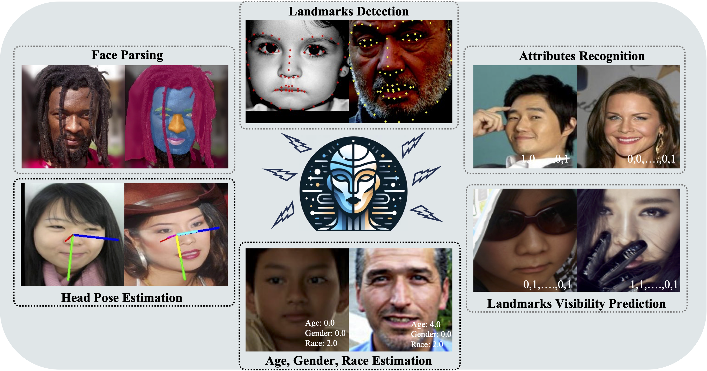

<div align="center">

# _FaceXFormer_ : A Unified Transformer for Facial Analysis

[Kartik Narayan*](https://kartik-3004.github.io/portfolio/) &emsp; [Vibashan VS*](https://vibashan.github.io) &emsp; [Rama Chellappa](https://engineering.jhu.edu/faculty/rama-chellappa/) &emsp; [Vishal M. Patel](https://engineering.jhu.edu/faculty/vishal-patel/)  

Johns Hopkins University

<a href='https://kartik-3004.github.io/facexformer_web/'></a>
<a href=''></a>
<a href='https://huggingface.co/kartiknarayan/facexformer'></a>

</div>

This is the official implementation of **[_FaceXFormer_](https://kartik-3004.github.io/facexformer_web/)**, a unified transformer for facial analysis:

1️⃣ that is capable of handling a comprehensive range of facial analysis tasks such as face parsing, landmark detection, head pose estimation, attributes recognition, age/gender/race estimation and landmarks visibility prediction<br>
2️⃣ that leverages a transformer-based encoder-decoder architecture where each task is treated as a learnable token, enabling the integration of multiple tasks within a single framework<br>
3️⃣ that effectively handles images "in-the-wild," demonstrating its robustness and generalizability across eight heterogenous tasks, all while maintaining the real-time performance of 37 FPS<br>



# News/Updates
- [03/19/2024] 🔥 We release FaceXFormer.

# Installation
```bash
conda env create --file environment_facex.yml
conda activate facexformer

# Install requirements
pip install torch==2.0.1+cu117 torchvision==0.15.2+cu117 torchaudio==2.0.2+cu117 --extra-index-url https://download.pytorch.org/whl/cu117
pip install -r requirements.txt
```
# Download Models
The models can be downloaded manually from [HuggingFace](https://huggingface.co/kartiknarayan/facexformer) or using python:
```python
from huggingface_hub import hf_hub_download

hf_hub_download(repo_id="kartiknarayan/facexformer", filename="facexformer/ckpts/model.pt", local_dir="./ckpts")
```
The directory structure should finally be:

```
  . ── facexformer ──┌── ckpts/model.pt
                     ├── networks
                     └── inference.py                    
```

## TODOs
- Release dataloaders for the datasets used.
- Release training script.

## Citation
If you find _FaceXFormer_ useful for your research, please consider citing us:

```bibtex
```
